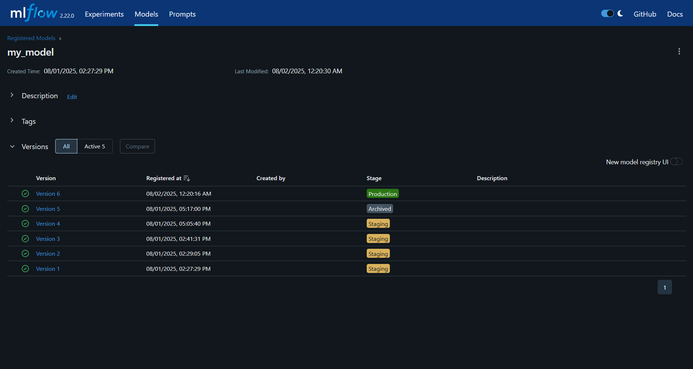
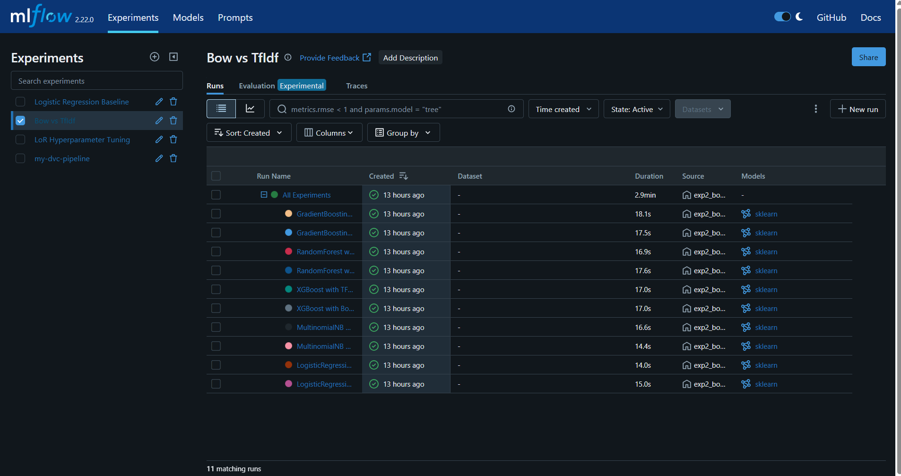

# 🚀 End-to-End IMDB Sentiment Analysis | MLOps Project

This project demonstrates a complete Machine Learning Ops (MLOps) pipeline for building, tracking, deploying, and monitoring a sentiment analysis model using IMDB movie reviews.

It showcases the transition from model development to full production deployment using modern tools and best practices in the MLOps lifecycle.

---

## 📌 Problem Statement

Build an ML model to predict the **sentiment (positive/negative)** of movie reviews from the IMDB dataset. Beyond training the model, the aim is to:
- Version control both code and data
- Track experiments
- Deploy the model in a production environment
- Automate the pipeline
- Monitor the app in real-time

---

## 🧰 Tech Stack & Tools

| Category | Tools |
|----------|-------|
| **Language** | Python |
| **ML Libraries** | Scikit-learn, Pandas, NumPy |
| **Web Framework** | Flask |
| **Data Versioning** | DVC |
| **Experiment Tracking** | MLflow |
| **Containerization** | Docker |
| **CI/CD** | GitHub Actions |
| **Cloud & Deployment** | AWS (S3, EC2, ECR, IAM) |
| **Monitoring** | Prometheus + Grafana |
| **Collaboration** | Git, DagsHub |
| **Project Structure** | Cookiecutter |

---

## 📂 Project Structure
```
Capstone-Project/
│
├── src/ # Source code for ingestion, training, prediction
├── .github/workflows/ # GitHub Actions CI/CD workflows
├── tests/ # Unit tests
├── models/ # Trained models
├── data/ # Raw & processed data (via DVC)
├── templates/ # HTML templates (if Flask frontend is added)
├── Dockerfile # For containerizing the Flask app
├── cluster.yaml # EKS cluster configuration (optional)
├── dvc.yaml # DVC pipeline definition
├── app.py # Flask API entry point
└── README.md # Project overview
```


---

## 🧪 ML Lifecycle

1. **Data Collection**: Pulled raw IMDB review data from AWS S3.
2. **Preprocessing**: Cleaned and vectorized the text data.
3. **Model Training**: Trained a sentiment classifier using `scikit-learn`.
4. **Experiment Tracking**: Used MLflow to log metrics, models, and parameters.
5. **Model Registry**: Registered models in MLflow (Production/Staging/Archived).
6. **Packaging**: Flask API built and containerized using Docker.
7. **Deployment**: Docker image pushed to AWS ECR and deployed on EC2.
8. **Automation**: GitHub Actions for continuous integration and image builds.
9. **Monitoring**: Live monitoring with Prometheus + Grafana.

---

## 🔁 CI/CD Workflow

- **GitHub Actions** triggers on push to `main` branch:
  - Build Docker image
  - Authenticate and push to AWS ECR
  - Deploy to EC2

---

## 📈 Monitoring

- Integrated **Prometheus** to track metrics like CPU/RAM usage.
- Configured **Grafana dashboards** for real-time monitoring of the app on EC2.

---

## 📸 Screenshots

<h4>MLflow Tracking UI<h4>

<h4>MLflow Experiment Tracking</h4>

<h4>☁️ AWS S3 Bucket Structure</h4>

<h4>🔁 GitHub Actions - CI/CD Pipeline</h4>


---

## 🚀 How to Run Locally

```bash
# Clone the repository
git clone https://github.com/amanp27/Capstone-Project.git
cd Capstone-Project

# Install dependencies
pip install -r requirements.txt

# Run the Flask app
python app.py
```

🧠 Learning Outcomes
Hands-on with MLOps lifecycle: from model training to monitoring

Experience deploying real ML apps on AWS

Automated pipelines with GitHub Actions

Model lifecycle management using MLflow

📬 Contact
Aman Prajapati
LinkedIn | GitHub
